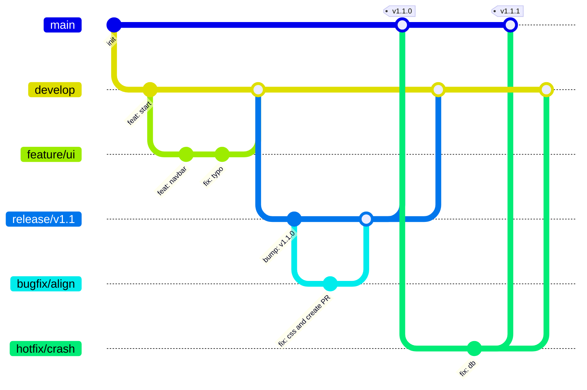

# Beyond the Commit: Architecting Scalable Workflows


Welcome! This repository contains the materials, scripts, and production-grade workflows for the talk **"Beyond the Commit"**. It demonstrates how to move from "it works on my machine" to a choreographed, industrial-grade engineering pipeline.

## 🎯 The Philosophy

Software engineering at scale requires more than just code—it requires a **contract** between developers and the pipeline. This repository demonstrates that contract using:
- **Git Flow**: Structured branching (Feature -> Develop -> Release -> Main).
- **Conventional Commits**: Machine-readable commit history.
- **Semantic Versioning**: Automated versioning based on impact (Major/Minor/Patch).
- **GitHub Actions**: Automated enforcement and publishing.

### Why "Industry Git" is Different
1.  **Auditability**: We need to know *who* changed *what* and *why*.
2.  **Automation**: Workflows should trigger automatically (Testing, Linting, Releasing).
3.  **Scale**: The process must handle 50+ developers without merge hell.

### The Golden Rules
> [!IMPORTANT]
> 1. **Atomic Commits**: One logical change per commit.
> 2. **Meaningful Messages**: Use the format `type(scope): subject`.
> 3. **Never Commit to Main**: Protect the "Source of Truth".
> 4. **Pull Requests**: The gateway for quality control.

---

## 📂 Repository Contents

| File / Folder | Description |
| :--- | :--- |
| `demo-live.ps1` | **The Magic Script**. Simulates a full dev lifecycle (Features, PRs, Releases) in minutes. |
| `demo_commits.md` | Cheat sheet of commits used during the live demo. |
| `.github/workflows/` | The logic core. Contains the actual YAML pipelines for CI/CD. |
| `idea.md` | Source material and outline for the presentation. |
| `Beyond The Commit.pptx` | The slide deck. |
| `present.ps1` | A terminal-based presentation tool for `idea.md`. |

---

## ⚡ How to Run the Live Demo

This script allows you to perform a live demonstration of the pipeline without needing to manually type every git command. It simulates 2 Developers working on features and a Release Manager cutting a release.

### Prerequisites

1.  **Git** installed.
2.  **GitHub CLI (`gh`)** installed and authenticated (`gh auth login`).
3.  **PowerShell** (Core or Windows).

### ⚠️ Critical Step: Remote Configuration

The script creates a sandboxed folder named `neuron-live-demo`. For the pipeline to actually run (Actions to trigger), this folder needs to point to a real GitHub repository.

**Before running the script (or immediately after it starts):**
1.  Create a **new empty repository** on GitHub (e.g., `neuron-live-demo`).
2.  You will need to add this remote to the local folder created by the script.
    *   *Note: You can let the script run until it pauses at "SETUP", then open a new terminal, `cd neuron-live-demo`, and run `git remote add origin <your-repo-url>`.*

### Running the Script

1.  Open your terminal in this repository.
2.  Run the script:
    ```powershell
    .\demo-live.ps1
    ```
3.  **Interactive Mode**: The script will pause before major actions. Use this time to explain the concept to your audience.
4.  **Follow the Prompts**: Press `Enter` to proceed through the steps.

---

## 🛠️ The Workflows Explained

The real value of this repo lies in `.github/workflows`. Here is what they do:

### 1. Branch Policy (`branch-policy.yml`)
*   **Trigger**: Pull Requests.
*   **Purpose**: Quality Control.
*   **Checks**:
    *   Ensures PR titles follow Conventional Commits (e.g., `feat: ...`).
    *   Enforces branch naming conventions (`feature/*`, `fix/*`, `release/*`).

### 2. Release Cutter (`cut-release.yml`)
*   **Trigger**: Manual (Workflow Dispatch).
*   **Purpose**: Automation.
*   **Action**: Calculates the next Semantic Version (e.g., 1.0.0 -> 1.1.0) based on commit history and creates the `release/vX.Y.Z` branch.

### 3. Release Handler (`release-handler.yml`)
*   **Trigger**: Pushing a Tag (e.g., `v1.1.0`).
*   **Purpose**: Deployment.
*   **Actions**:
    *   Builds the artifacts.
    *   Creates a Docker image.
    *   Publishes a GitHub Release with an auto-generated Changelog.

---

## 🔄 The Lifecycle Visualized



---

## 🚀 How to Present

### Option A: Slides
Open `Beyond The Commit.pptx`.

### Option B: Terminal Mode
Run the terminal-based presenter:
```powershell
.\present.ps1
```
*   **Controls**: `Right Arrow` / `Enter` to Next, `Q` to Quit.

---

## ❓ Troubleshooting

**`gh: command not found`**
Install the GitHub CLI.

**`Permission denied (publickey)`**
Ensure your SSH keys are set up with GitHub, or use HTTPS for the remote origin.

**Workflows not running?**
Ensure you have enabled GitHub Actions in the new repository settings.

---

## 📜 License

MIT
